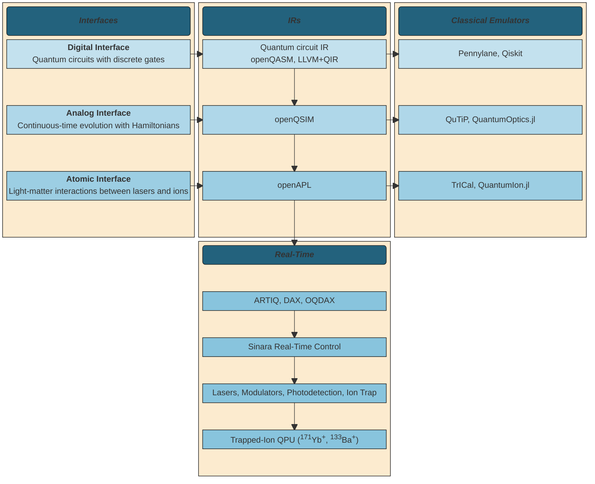

# 

<h2 align="center">
    Program the world's first open-source, full-stack quantum computer.
</h2>

[](https://docs.openquantumdesign.org/)
[](https://pypi.org/project/equilux)
[](https://github.com/OpenQuantumDesign/equilux/actions/workflows/deploy_docs.yaml)

[](https://github.com/ambv/black)
[](https://opensource.org/licenses/Apache-2.0)

## About
Open Quantum Design (OQD) is a non-profit foundation supporting the development of full-stack, open-source quantum computers.
OQD's current designs are based on laser-cooled trapped ion quantum computing hardware, including real-time control, backend and frontend software.
This documentation covers the software components of the OQD stack, including the core programming interfaces,
classical emulation backends, compiler infrastructure, and cloud server containers.

`equilux` is the top-level package to access the full OQD software suite in a single place.

## What's here

- [Quick Start](#quickstart) <br/>
- [Installation](#installation) <br/>
- [The Stack](#stack) <br/>
- [Software](#software) <br/>
- [Hardware](#hardware) <br/>
- [Documentation](#documentation) <br/>

## Quick start <a name="quickstart"></a>

## Installation <a name="installation"></a>
To install `equilux` and the suite Open Quantum Design software tools,
```bash
pip install equilux
```

Alternatively, the repository can be cloned and installed locally,
```bash
git clone https://github.com/OpenQuantumDesign/equilux
pip install .
```

## The stack <a name="stack"></a>


Open Quantum Design's quantum computing stack can be interfaced at different levels, including the digital, analog, and atomic layers.


### Software <a name="software"></a>
OQD's software stack components include Python interfaces at the digital, analog, and atomic layers,
classical emulators, compiler infrastructure, and cloud server components.

### Hardware <a name="hardware"></a>

Planned supported hardware backends include
the [Bloodstone](docs/hardware/devices.md) processor based on<sup>171</sup>Yb<sup>+</sup> ions
and the [Beryl](docs/hardware/devices.md) processor based on<sup>133</sup>Ba<sup>+</sup> ions.


## Getting started <a name="Getting Started"></a>
Below is a short example of how to use the analog interface to specify, serialize,
and simulate an analog quantum program - here, a single-qubit Rabi-flopping experiment.

```python
from oqd_core.interface.analog.operator import PauliZ, PauliX
from oqd_core.interface.analog.operation import AnalogCircuit, AnalogGate
from oqd_core.backend.metric import Expectation
from oqd_core.backend.task import Task, TaskArgsAnalog
from oqd_analog_emulator.qutip_backend import QutipBackend

X = PauliX()
Z = PauliZ()

Hx = AnalogGate(hamiltonian=X)

circuit = AnalogCircuit()
circuit.evolve(duration=10, gate=Hx)
circuit.measure()

args = TaskArgsAnalog(
  n_shots=100,
  fock_cutoff=4,
  metrics={"Z": Expectation(operator=Z)},
  dt=1e-3,
)

task = Task(program=circuit, args=args)

backend = QutipBackend()
results = backend.run(task=task)
```

## Documentation <a name="documentation"></a>
Documentation can be found at [docs.openquantumdesign.org](https://docs.openquantumdesign.org/en/latest/).
