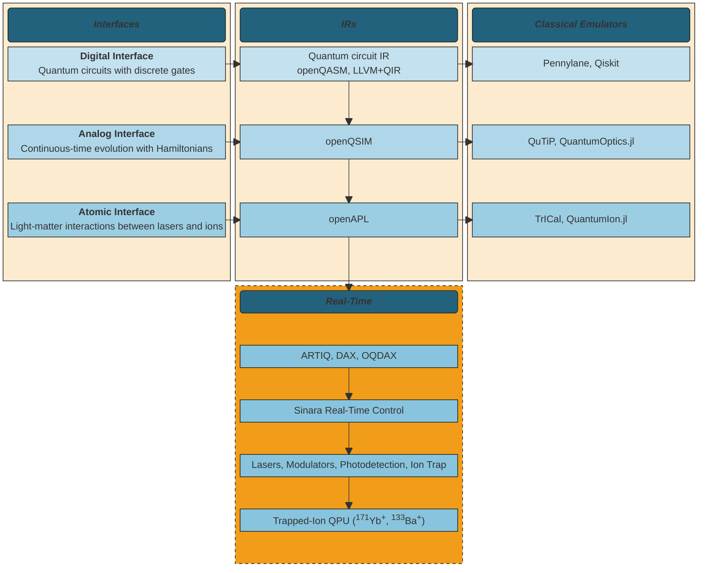

# 

  
  

    <h2 align="center">
        Open Quantum Design: Quantum Processor Hardware
    </h2>

## What's Here
The heart of Open Quantum Design's mission and vision is to build open-source, full-stack
quantum computers. The second generation of trapped-ion devices, coined [Bloodstone](#bloodstone) and [Beryl](#beryl),
are currently under construction and testing. Designs, including electrical, photonic, and mechanical,
will be opened sourced for community use and contribution.
The real-time control stack builds on top of the open-hardware [Sinara](#sinara) ecosystem,
including [ARTIQ](#artiq) and [DAX](#dax)

### Bloodstone 
* Ion species: 171Yb+
* Target number of qubits: 30 – 50
* Trap architecture: Segmented Blade Trap
* SPAM individual addressing: DMD
* Coherent individual addressing with: Double-pass AOM + AOD

{: style="width:300px"}
{: style="width:300px"}

### Beryl 
* Ion species: 133Ba+, 137Ba+, 138Ba+
* Target number of qubits: 16
* Trap architecture: [Sandia National Laboratories Phoenix Trap (HOA 2.0 platform)](https://arxiv.org/abs/2009.02398)
* SPAM individual addressing: AOMs
* Coherent individual addressing: Laser written waveguide + AOMs

{: style="width:600px"}

## Real-time Control System 
The OQD stack builds on the [Sinara](https://m-labs.hk/experiment-control/sinara-core/) and [ARTIQ](https://m-labs.hk/artiq/) ecosystems for real-time control.

### Sinara 
[Sinara](https://sinara-hw.github.io/) is an open-source hardware ecosystem originally designed for use in quantum physics experiments running the ARTIQ control software.
The hardware is also suitable for a broad range of laboratory and test & measurement applications.
It is licensed under CERN OHL v1.2.

### ARTIQ (Advanced Real-Time Infrastructure for Quantum) 
[The Advanced Real-Time Infrastructure for Quantum physics framework](https://github.com/m-labs/artiq) is a software framework developed by M-Labs that provides Python bindings to the Sinara real-time signal generation and detection apparatus at the core of the electrical apparatus.
ARTIQ functions by exposing control of the individual channels of custom-specified Sinara hardware in the Python programming language.
The system maintains an internal clock and timeline.
Events specified programmatically by the user are applied to the timeline and sent to the Sinara hardware with a series of queues.
The Sinara hardware then executes the instructions with nanosecond precision on a series of FPGAs.

### DAX (Duke ARTIQ Extensions) 
[The Duke ARTIQ Extensions (DAX)](https://gitlab.com/duke-artiq/dax) are additional tools and capabilities drawn from traditional software design principles for the ARTIQ framework.
ARTIQ allows low-level access to individual channels on the Sinara hardware.
DAX provides a framework for grouping channels into logical modules representing appropriate experimental apparatus abstractions and services that use those modules to perform regular, repeatable tasks.
