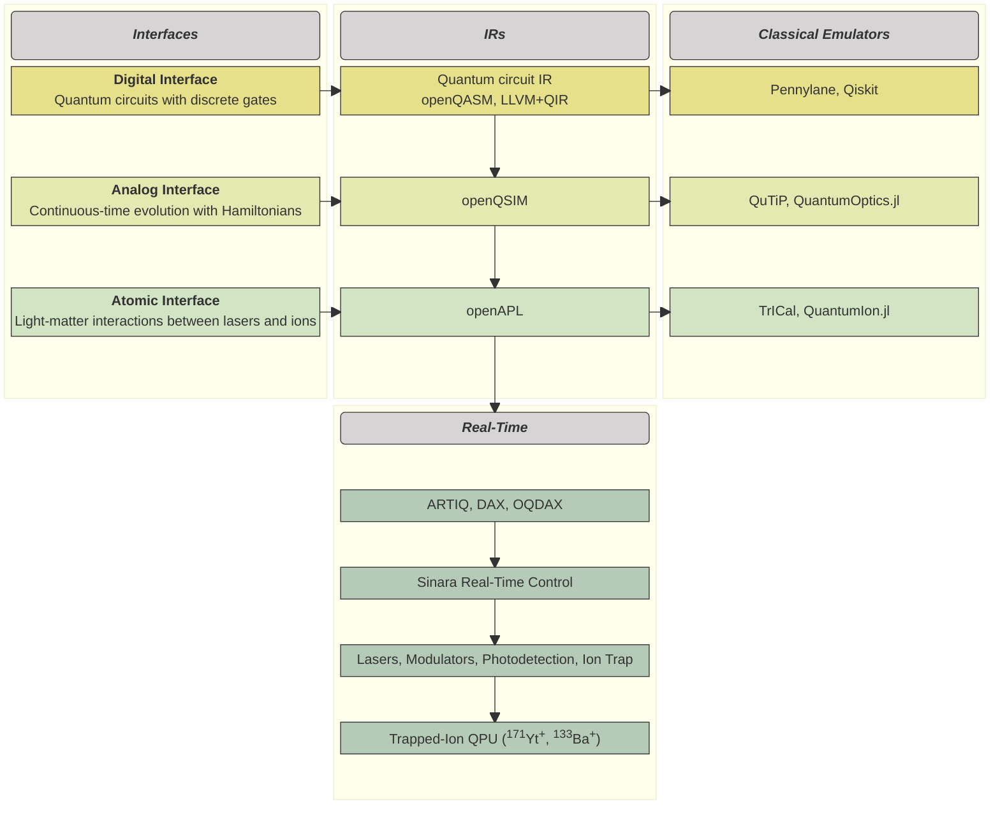

# 

<p align="center">
  
  
</p>

<div align="center">
    <h2 align="center">
    Open Quantum Design
    </h2>
</div>

<!-- prettier-ignore -->
/// admonition | Note
    type: note
Welcome to the Open Quantum Design documentation.
///

## What's here
Open Quantum Design is a non-profit foundation supporting the development of full-stack, open-source quantum computers.
OQD's current designs are based on laser-cooled trapped ion quantum computing hardware, including real-time control, backend and frontend software.
This documentation covers the software components of the OQD stack, including the core programming interfaces,
classical emulation backends, compiler infrastructure, and cloud server containers.

## The stack
OQD's quantum computer stack can be interfaced at different levels, including the digital layer, analog layer, and atomic layer.


## Getting Started <a name="Getting Started"></a>
Here's a short example of how to use the analog interface to specify, serialize, and simulate an analog quantum program.
We use a simple, single-qubit Rabi-flopping experiment as an example:
```python
from oqd_core.interface.analog.operator import PauliZ, PauliX
from oqd_core.interface.analog.operation import AnalogCircuit, AnalogGate
from oqd_core.backend.metric import Expectation
from oqd_core.backend.task import Task, TaskArgsAnalog
from oqd_analog_emulator.qutip_backend import QutipBackend

X = PauliX()
Z = PauliZ()

Hx = AnalogGate(hamiltonian=X)

circuit = AnalogCircuit()
circuit.evolve(duration=10, gate=Hx)
circuit.measure()

args = TaskArgsAnalog(
  n_shots=100,
  fock_cutoff=4,
  metrics={"Z": Expectation(operator=Z)},
  dt=1e-3,
)

task = Task(program=circuit, args=args)

backend = QutipBackend()
results = backend.run(task=task)
```
